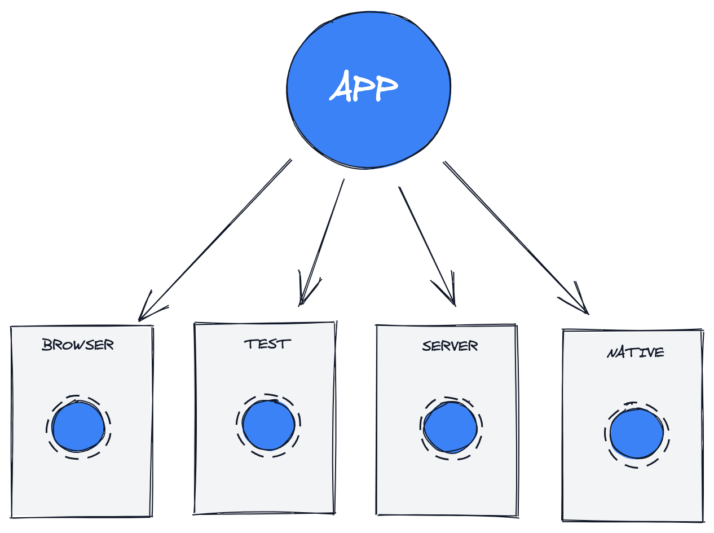
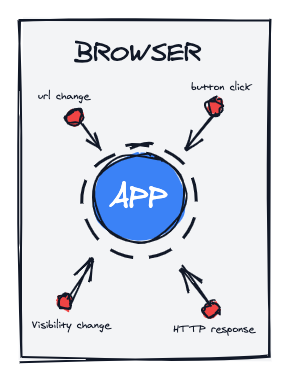
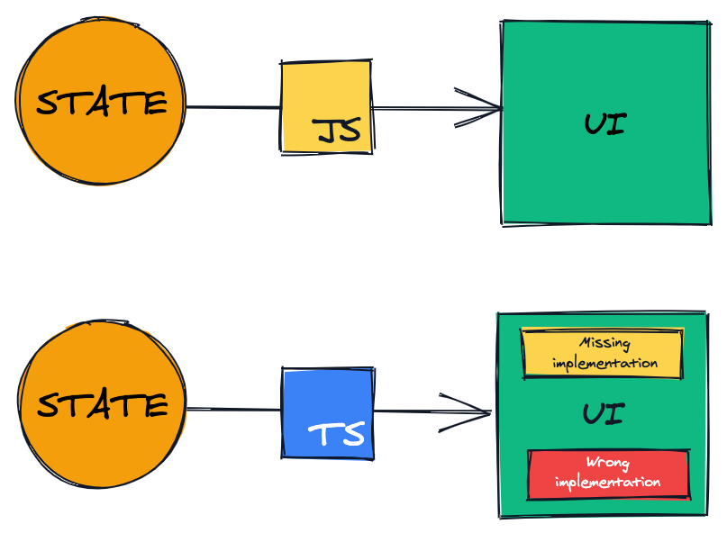

# The Mental Model

Very often when you read books about application architecture you are introduced to patterns like [MVC](https://no.wikipedia.org/wiki/Model%E2%80%93view%E2%80%93controller), [MVVM](https://en.wikipedia.org/wiki/Model%E2%80%93view%E2%80%93viewmodel) etc. These patterns points to the relationship and separation of the _state_, _logic_ and _UI_. In this book we are also going to discuss the separation and relationship of state, logic and UI, but that is only part of the puzzle. On our quest for predictable user experiences we have to go further than that.

To better understand why we are discussing the concepts in the next sections I want you to think about your application as being mounted into an environment. This environment could be the browser, a test runner, the server or even a native application.



Now I want you to think about the environment randomly spitting out events. These events are everything from a user interaction event, HTTP response, url change and so on. You can not guarantee when and in what order these events occur, they just happen.



The job of our application is to make sense of these unpredictable events and create a predictable experience.

## Explicitness And Constraints

As mentioned in the introduction, programming is about abstract concepts. Two of those concepts is explicitness and constraints, and they often go hand in hand, improving the predictability of the code. What to take notice of though is that explicit and constrained code is not about creating a path of least resistance. Quite the opposite. Explicitness and constraints requires you to think more about how to name things. It also sometimes feels that the constraints are workin against you. "Why cant' I just?". I will point out through these chapters where we apply explicitness and constraints and you will more clearly see that we on one side have to think more, but on the other side gain super powers.

## TypeScript

It might seem weird that I bring up [TypeScript](https://www.typescriptlang.org/) as part of our mental model. But TypeScript is such an important part of how we create predictability in our code. If you just imagine the two components of **state** and **UI**. Since the UI is a product of your state, any change to the definition of the state immediately breaks your UI. With TypeScript you know exactly what parts of your UI has broken related to changes to your state definition. But that is not all. With the concepts we are discussing in this book TypeScript will even be able ensure that your UI is handling all variations of the state it is consuming.



## Modeling state

Let's imagine we are modeling authentication state. The way we typically approach is to identify what state we need. We ask ourselves questions like:

- _"I need to display a spinner when I am authenticating, let me add an isAuthenticating state for that"_
- _"We need to store the user somewhere, let's add a user state"_
- _"And yeah, btw, if we have an error we also need to put that somewhere"_

We are going to use TypeScript typing to model the state:

```ts
type Auth = {
  isAuthenticating: boolean;
  user: { username: string } | null;
  error: string | null;
};
```

How can we be certain that a UI is correctly consuming this state? Just from the perspective of showing a spinner, do we actually know when it should be displayed? It should of course show the spinner when `isAuthenticating` is `true`, but what if we also have a `user` or an `error`, or both? These three state properties actually represents **8 possible** states.

```ts
{ isAuthenticating: true, user: null, error: null }
{ isAuthenticating: false, user: null, error: null }
{ isAuthenticating: true, user: {}, error: null }
{ isAuthenticating: false, user: {}, error: null }
{ isAuthenticating: true, user: {}, error: '' }
{ isAuthenticating: false, user: {}, error: '' }
{ isAuthenticating: true, user: null, error: '' }
{ isAuthenticating: false, user: null, error: '' }
```

You might think I am being a state drama queen here, and to some extent I am. In most apps you would probably get this right, but what if we could half the number of states and be perfectly explicit about what they represent? As we have talked about, explicitness and constraints leads to predictability.

## Explicit states

The state we modeled above would rather be modeled like this using explicit states.

```ts
type Auth =
  | {
      state: "UNAUTHENTICATED";
    }
  | {
      state: "AUTHENTICATING";
    }
  | {
      state: "AUTHENTICATED";
      user: { username: string };
    }
  | {
      state: "ERROR";
      error: string;
    };
```

This typing is what we call a **union** in TypeScript. In practice it means Auth can be either of these objects where we are using the property _state_ to be explicit about what state each object represents. And this dear reader is what everything else in this book is built upon.

First of all we are explicit about the actual user flow states that can happen. We have also contrained the possible states from 8 to 4. This leads to predictability in your code as there is really no way for the consumer of this state to get this wrong.

What we have also achieved here, using TypeScript, is that whenever we check what state we are in, TypeScript tells us what values are available within that state.

```tsx
const AuthComponent = () => {
  const auth = useAuth();

  if (auth.state === "AUTHENTICATED") {
    // TypeScript tells me this is now available, and yells
    // if something would ever change, making it invalid
    auth.user;
  }

  return null;
};
```

So this shows us how we get help from TypeScript to identify what states are there and what values are available in each state. That means if we change the Auth implementation we instantly know what UI is affected by that change.

We have also achieved another superpower that we will look into later which ensures that we do not only consume the states correctly, but also that our UI is not missing out on any states.

## State transitions

With explicit states our application moves forward by transitioning from one explicit state to an other. In our previous approach it was perfectly fine to just:
